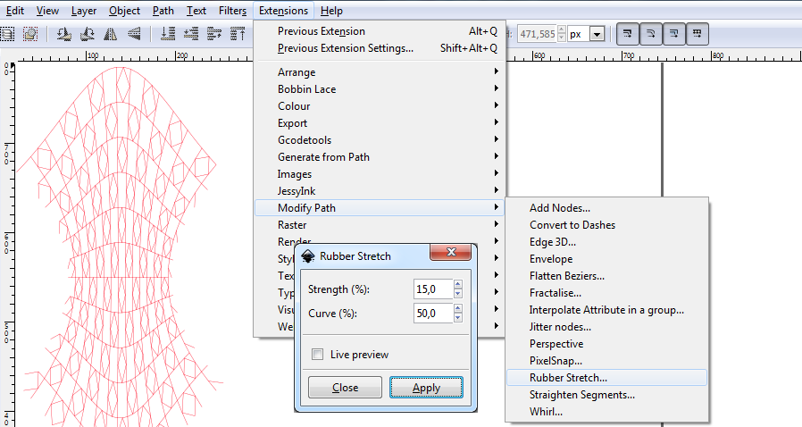
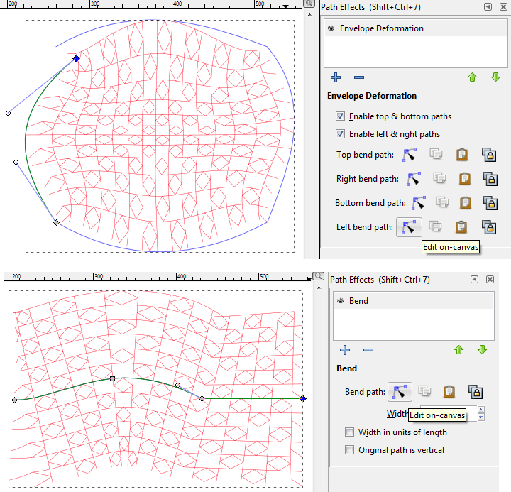

Standard Deformations Tools
===========================

After generating a pattern, you can apply deformations with standard InkScape tools.
The following screenshots show just some examples in progress.

The following effects require to `combine` the desired objects into a single `path`.
In more complex situations the `select same...` function under the `edit` menu can pay off.

