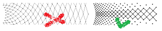
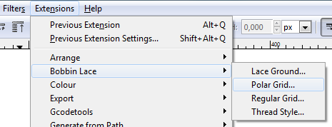
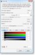
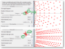
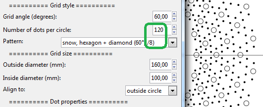
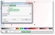
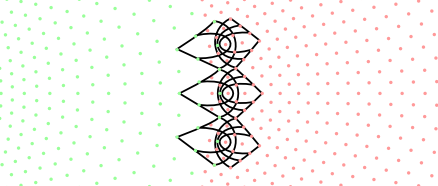
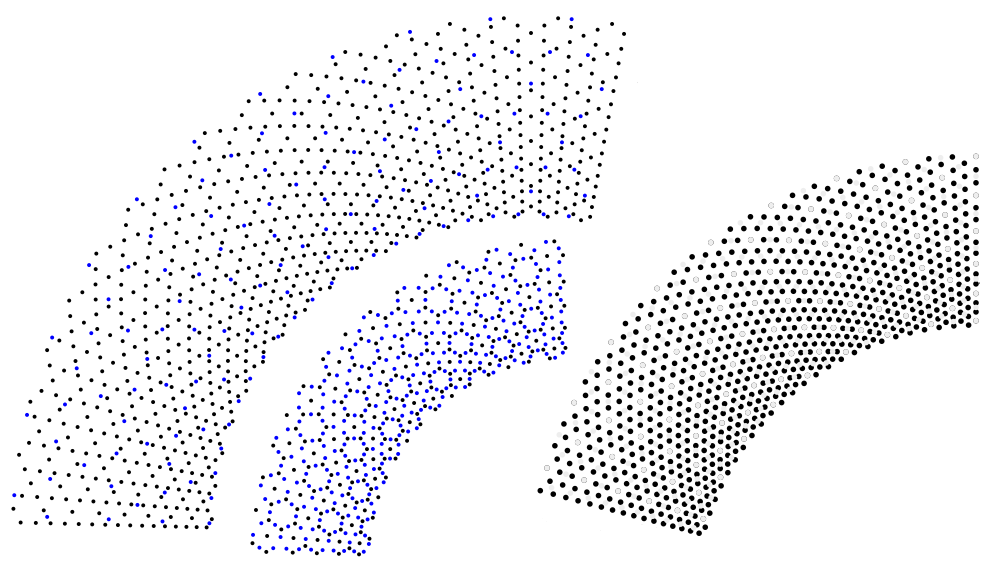

Polar Grids
===========

- [Basic Usage](#basic-usage)
- [Repeats and number of dots](#repeats-and-number-of-dots)
- [Grouped dots](#grouped-dots)
- [Concentric grids](#concentric-grids)
- [Merge grids](#merge-grids)
- [Java based versions](#java-based-versions)

The diameter of the concentric circles in common polar grids increases at a constant rate, as shown on the left.
DiBL generates grids with a consistent shape of the stitches, 
the diameter of the circles increases in proportion with the distance between dots along each circle.

This article is about the InkScape extension, 
with the [web-based version](https://d-bl.github.io/polar-grids/) you gain examples but loose functionality.

Basic Usage
-----------

Once the extensions are properly [installed], you can select `polar grid` from the `bobbin lace` menu under `extensions`.

[installed]: /inkscape-bobbinlace/

A dialog allows to configure the grid. A few notes:
* Within the choice list of grid patterns, a tiny cheat sheet advises angles and repeat factors.
* Traditional Binche snow flakes require an angle of 60 degrees.
* Create the grid in a separate layer to enable locking while drawing the pattern or hide it for printing.
* Many dots, shallow angles and/or a big difference in the diameters
  may require a lot of time to compute and render. 
* To connect the dots: switch on snap cusp nodes to the centre of bounding boxes.
  But of course you can just print the grid and continue with pencil or ink.

dialog: 
effects of ignoring the cheat sheet: 

Pin distances
-------------

Pin distances should more or less match the [thread size].
Multiply the desired radius by three and divide the result with the desired distance
to get a rough estimation of the required number of dots.
The value however changes from the inside to the outside.
The measurement tool of InkScape (available since release 0.91) can tell you any distance you want to know.

[thread size]: http://bobbin-lace.wikispaces.com/Thread+width+and+pattern+size

# Repeats and number of dots

Keep repeats in mind to choose the number of dots.
For the fans shown below the number of dots should be a multitude of three as indicated by the red dots.
The style of grids however may also have a repeat, which is indicated by the selected grid pattern.

Grouped dots
------------

The generated dots are grouped per circle.
The properties of a ring of dots has a label with the diameter.
The number of dots on a circle is shown by the status bar of InkScape.
To delete sections of the grid (to keep just a pie or fan)
you first have to ungroup these circles,
the label with the diameter will get lost.

properties: 

Concentric grids
----------------

A big difference between inner and outer diameters can cause a big difference in pin distances.
You can overcome this with concentric grids with different numbers of dots.
Take the diameter of the last or second-last ring as the diameter to align to.

The ratio of dots between the green and red grid in the example is 2:3.
This difference could for example be bridged with asymmetrical spiders,
in this case four legs on the inside, six on the outside.

Merge grids
-----------

Merging grids allows more than the built-in choices of dot-patterns. A few examples:
* hexagon + triangle: 60 degrees, 120 dots + 30 degrees, 80 dots
* hexagon + triangle: 30 degrees, 120 dots + 60 degrees, 80 dots
* diamonds, 30 degrees: 120 dots + 80 dots
Align the second grid to a second ring for alternating patterns.

The [math] is an approximation, so you might see small inaccuracies with extreme values.
[math]: https://github.com/d-blpull/5/files#diff-326bb6c119212f45e228f5e0516187e3

Java based versions
-------------------

The Java [proof of concept] in DiBL is a stripped version of the stand alone Java version
in the [BobbinWork] project, the interface of this [old generator] might be challenging
and it provides only the diamond pattern of dots. It served as a blue print for the python script.

[proof of concept]: https://github.com/jo-pol/DiBL/tree/5d5dc36e50ccc6468b62d358381cda1cda64ad6b/standalone/grids/dibl-polar
[BobbinWork]: https://github.com/jo-pol/bobbinwork
[old generator]: https://storage.googleapis.com/google-code-archive-downloads/v1/code.google.com/bobbinwork/bwpGrid-rel-2.0.115.jar
