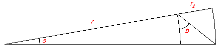
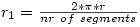
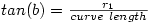
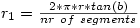

Original math for Polar Grids
=============================

The angle of the polar grid is kept constant with the following theory.

When <i>a</i> is small and <i>r</i> large, the small edge of the pie could be considered straight. 
 
With <i>b = 45</i> degrees, <i>r1</i> equals the small pie edge. 
 
The approximation above in math:

For the circle we get:

From the mathematical rule:

we can deduce:

