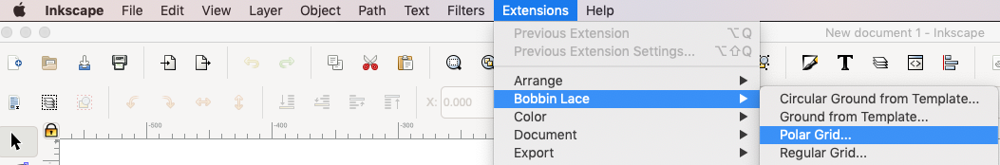
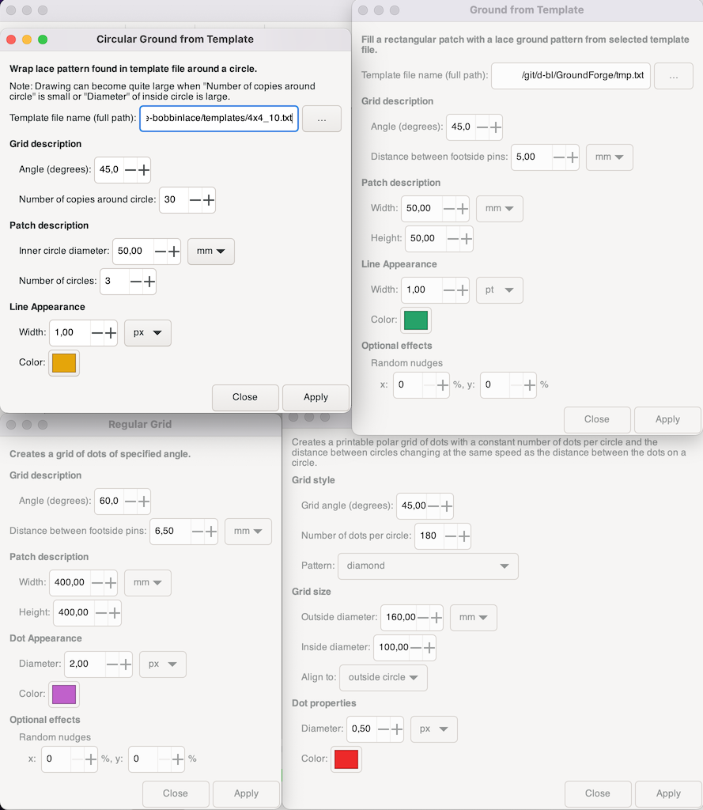

Plugin Overview
===============

Four examples that suit as grids respective pair diagrams for grounds in bobbin lace.

Each sample is generated by another plugin. 
The screen shot below shows the dialogs with descriptions.
The [side-bar](#sidebar) has a help page for each one.

[zoom in](home-images/dialogs.png)

